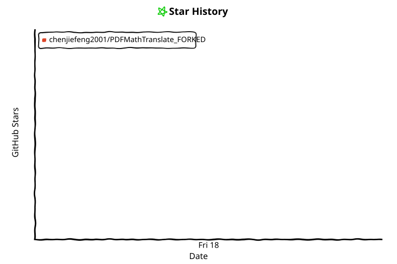

<div align="center">
	<a href="https://go.warp.dev/PDFMathTranslate" target="_blank">
		<sup>Special thanks to:</sup>
		<br>
		
		<br>
		<h>Warp, built for coding with multiple AI agents</b>
		<br>
		<sup>Available for macOS, Linux and Windows</sup>
	</a>
</div>

<br>

<div align="center">

English | [简体中文](docs/README_zh-CN.md) | [繁體中文](docs/README_zh-TW.md) | [日本語](docs/README_ja-JP.md) | [한국어](docs/README_ko-KR.md)


<h2 id="title">PDFMathTranslate</h2>

<p>
  <!-- PyPI -->
  <a href="https://pypi.org/project/pdf2zh/">
    </a>
  <a href="https://pepy.tech/projects/pdf2zh">
    </a>
  <a href="https://hub.docker.com/r/byaidu/pdf2zh">
    </a>
  <a href="https://hellogithub.com/repository/8ec2cfd3ef744762bf531232fa32bc47" target="_blank"></a>
  <a href="https://gitcode.com/Byaidu/PDFMathTranslate/overview">
    </a>
  <a href="https://huggingface.co/spaces/reycn/PDFMathTranslate-Docker">
    </a>
  <a href="https://www.modelscope.cn/studios/AI-ModelScope/PDFMathTranslate">
    </a>
  <a href="https://github.com/Byaidu/PDFMathTranslate/pulls">
    </a>
  <a href="https://t.me/+Z9_SgnxmsmA5NzBl">
    </a>
  <!-- License -->
  <a href="./LICENSE">
    </a>
</p>

<a href="https://trendshift.io/repositories/19816" target="_blank"></a>

</div>

<h2 id="updates">1. What does this do?</h2>

Scientific PDF document translation preserving layouts.

- 📊 Preserve formulas, charts, table of contents, and annotations.
- 🌐 Support [multiple languages](#usage), and diverse [translation services](#usage).
- 🤖 Provides [commandline tool](#usage), [interactive user interface](#install), and [Docker](#install)
- 🛡️ Long-running reliability: task self-healing watchdogs, bounded retries, queue liveness watchdog, and per-thread connection pools keep big documents translating without hanging or connection storms.
- 🔄 Switchable PDF parse engine: BabelDOC / legacy (pdfminer) built in, plus optional MinerU/magic-pdf (`--parse-engine magicpdf`) for scanned or damaged-text PDFs — auto-falls back to the legacy kernel when the engine is unavailable.
- ⚡ Parallel page processing with worker-process isolation, GPU backend propagation (`--backend cuda`/`dml` also accelerates BabelDOC's internal layout ONNX inference via `PDF2ZH_BABELDOC_BACKEND`), and automatic CPU degradation on worker crashes.
- 📚 Concurrent batch processing: multi-file tasks translate several documents at once (`PDF2ZH_BATCH_CONCURRENCY`, default 2, max 4), with monotonic overall progress and per-file result/failure accounting — a single failed file never aborts the batch.

<div align="center">

</div>

<h2 id="updates">2. Recent Updates</h2>
- [August 24, 2026] Concurrent batch execution: multi-file tasks now process files in parallel (`PDF2ZH_BATCH_CONCURRENCY`, default 2, clamped 1–4; `1` restores strict serial semantics), with linear overall progress aggregation and race-free per-file result recording.
- [August 17, 2026] Switchable parse engine: MinerU/magic-pdf as an optional PDF parsing layer (`--parse-engine magicpdf`, `--magicpdf-ocr`, `--magicpdf-render`), with automatic config generation, weight pre-check, and legacy-kernel fallback; BabelDOC OCR tri-state (`--babeldoc-ocr`), and GPU backend propagation to BabelDOC's internal doclayout ONNX session (`PDF2ZH_BABELDOC_BACKEND`).
- [August 13, 2026] Reliability hardening: bounded translate retries (`PDF2ZH_TRANSLATE_RETRY`), terminal-task pruning via `PDF2ZH_TASK_RETENTION_SECONDS`, GUI queue liveness watchdog, and direct (queue-less) control buttons for cancel/pause/resume/skip/download.
- [August 13, 2026] Parallel engine: isolated worker processes with GPU backend propagation (`--backend`), automatic CPU degradation after worker crashes, incremental per-chunk retry with serial patch fallback, and main-process model warm-up with atomic optimized-cache publishing.
- [August 13, 2026] Translator transport hardening: per-thread connection pools (32) that eliminate "Connection pool is full" connection storms, fast-fail on Google 429/CAPTCHA blocks with an actionable error, long-text chunking (>4000 chars) that fixes silent truncation, and request timeouts to prevent blackhole hangs.
- [August 13, 2026] No-text passthrough: scanned/vector/image-only PDFs are detected and passed through without embedding multi-MB fonts (previously 603KB input ballooned to ~10MB output); CLI now creates missing output directories and supports parallel settings properly.
- [March 23, 2026] Experimental support for v2.0 translation kernel using isolated environment (`--mode precise`). (by [@reycn](https://github.com/reycn))
- [March 22, 2026] Supporting MiniMax (PR by [@octo-patch](https://github.com/octo-patch))
- [March 22, 2026] Fixing OpenAI-related issues (PR by [@samqin123](https://github.com/samqin123))
- [March 22, 2026] Fixing HTTP-related issues (PR by [@soukouki](https://github.com/soukouki))
- [March 22, 2026] Faster model loading on mac and OONX platforms, GUI starting-up, version printing, and continuous integration.(by [@reycn](https://github.com/reycn))
- [May 9, 2025] pdf2zh 2.0 Preview Version [#586](https://github.com/Byaidu/PDFMathTranslate/issues/586): The Windows ZIP file and Docker image are now available.

  > [!NOTE]
  >
  > 2.0 Moved to a new repository under the organization: [PDFMathTranslate/PDFMathTranslate-next](https://github.com/PDFMathTranslate/PDFMathTranslate-next)
  > 
  > Version 2.0 official release has been published.

<h2 id="use-section">3. Use 🌟</h2>
<h3 id="demo">3.1 Online Service 🌟</h3>

You can try our application out using either of the following demos:

- [Public free service](https://pdf2zh.com/) online without installation _(recommended)_.
- [Immersive Translate - BabelDOC](https://app.immersivetranslate.com/babel-doc/) Free usage quota is available; please refer to the FAQ section on the page for details. _(recommended)_
- [Demo hosted on HuggingFace](https://huggingface.co/spaces/reycn/PDFMathTranslate-Docker)
- [Demo hosted on ModelScope](https://www.modelscope.cn/studios/AI-ModelScope/PDFMathTranslate) without installation.

Note that the computing resources of the demo are limited, so please avoid abusing them.

<h3 id="install">3.2 Local Installation</h3>

For different use cases, we provide distinct methods to use our program:

<details open>
  <summary>3.2.1 Python: Install using uv</summary>

1. Python installed (3.11 <= version <= 3.12)

2. Install our package:

   ```bash
   pip install uv
   uv tool install --python 3.12 pdf2zh
   ```

3. Execute translation, files generated in [current working directory](https://chatgpt.com/share/6745ed36-9acc-800e-8a90-59204bd13444):

   ```bash
   pdf2zh document.pdf
   ```

</details>
<details>
  <summary>3.2.2 Python: Install using pip</summary>

1. Python installed (3.11 <= version <= 3.12)
2. Install our package:

   ```bash
   pip install pdf2zh
   ```

3. Execute translation, files generated in [current working directory](https://chatgpt.com/share/6745ed36-9acc-800e-8a90-59204bd13444):

   ```bash
   pdf2zh document.pdf
   ```

</details>
<details>
  <summary>3.3.3 Python: Graphic user interface</summary>

1. Python installed (3.11 <= version <= 3.12)

2. Install our package:

  ```bash
  pip install pdf2zh
  ```

3. Start using in browser:

   ```bash
   pdf2zh -i
   ```

4. If your browser has not been started automatically, goto

   ```bash
   http://localhost:7860/
   ```

   

The GUI features a live event stream (SSE with `Last-Event-ID` reconnect recovery), real-time progress with ETA, multi-file queueing with per-file pause/resume/skip, and a configurable upload size limit (`--max-file-size`, default 100 MB).

See [documentation for GUI](./docs/README_GUI.md) for more details.

</details>

<details>
  <summary>3.2.4 Application: On Windows</summary>

1. Download pdf2zh-version-win64.zip from [release page](https://github.com/Byaidu/PDFMathTranslate/releases)

2. Unzip and double-click `pdf2zh.exe` to run.


  > [!TIP]
  >
  > - If you're using Windows and cannot open the file after downloading, please install [vc_redist.x64.exe](https://aka.ms/vs/17/release/vc_redist.x64.exe) and try again.
  > 
</details>


<details>

<summary>3.2.5 Reference manager: Zotero Plugin</summary>


See [Zotero PDF2zh](https://github.com/guaguastandup/zotero-pdf2zh) for more details.

</details>


<details>
  <summary>3.2.6 Docker: Containerized Deployment</summary>

1. Pull and run:

   ```bash
   docker pull byaidu/pdf2zh
   docker run -d -p 7860:7860 byaidu/pdf2zh
   ```

2. Open in browser:

   ```
   http://localhost:7860/
   ```

For docker deployment on cloud service:

<div>
<a href="https://www.heroku.com/deploy?template=https://github.com/Byaidu/PDFMathTranslate">
  </a>
<a href="https://render.com/deploy">
  </a>
<a href="https://zeabur.com/templates/5FQIGX?referralCode=reycn">
  </a>
<a href="https://template.sealos.io/deploy?templateName=pdf2zh">
  </a>
<a href="https://app.koyeb.com/deploy?type=git&builder=buildpack&repository=github.com/Byaidu/PDFMathTranslate&branch=main&name=pdf-math-translate">
  </a>
</div>

> [!TIP]
>
> - If you cannot access Docker Hub, please try the image on [GitHub Container Registry](https://github.com/Byaidu/PDFMathTranslate/pkgs/container/pdfmathtranslate).
> ```bash
> docker pull ghcr.io/byaidu/pdfmathtranslate
> docker run -d -p 7860:7860 ghcr.io/byaidu/pdfmathtranslate
> ```
</details>

<details>
  <summary>3.2.7 Source: Build and install locally</summary>

If you have cloned the repository and want to build and install from source (e.g., to apply custom modifications or test the latest changes):

1. **Prerequisites**: Python 3.11 or 3.12, and [Git](https://git-scm.com/).

2. **Clone the repository**:

   ```bash
   git clone https://github.com/Byaidu/PDFMathTranslate.git
   cd PDFMathTranslate
   ```

3. **Install build dependencies and build**:

   Using pip:

   ```bash
   pip install build hatchling
   python -m build
   pip install dist/pdf2zh-*.whl
   ```

   Or install in editable mode for development:

   ```bash
   pip install -e .
   ```

   > [!TIP]
   >
   > - Editable mode (`-e`) lets you modify the source code and see changes immediately without reinstalling.
   > - If you encounter issues with optional dependencies (e.g., GPU acceleration), you can install extras:
   >   ```bash
   >   pip install -e .[cuda]     # for NVIDIA CUDA support
   >   pip install -e .[dml]      # for DirectML (Windows)
   >   pip install -e .[backend]  # for Flask + Celery backend
   >   pip install -e .[magicpdf] # for the optional MinerU/magic-pdf parse engine
   >   ```

4. **Verify installation**:

   ```bash
   pdf2zh --version
   ```

   You should see the version number printed.

</details>

<details>
  <summary>3.2.* Solutions for network issues in installation</summary>

  Users in specific regions may encounter network difficulties when loading the AI model. The current program relies on the AI model (`wybxc/DocLayout-YOLO-DocStructBench-onnx`), and some users are unable to download it due to these network issues.

  To address issues with downloading this model, use the following environment variable as a workaround:

  ```shell
  set HF_ENDPOINT=https://hf-mirror.com
  ```

  For PowerShell user:

  ```shell
  $env:HF_ENDPOINT = https://hf-mirror.com
  ```

  If the solution does not work to you / you encountered other issues, please refer to [Frequently Asked Questions](https://github.com/Byaidu/PDFMathTranslate/wiki#-faq--%E5%B8%B8%E8%A7%81%E9%97%AE%E9%A2%98).
</details>


<h2 id="usage">4. Technical Details</h2>

### 4.1 Advanced options

Execute the translation command in the command line to generate the translated document `example-mono.pdf` and the bilingual document `example-dual.pdf` in the current working directory. Use Google as the default translation service. More support translation services can find [HERE](https://github.com/Byaidu/PDFMathTranslate/blob/main/docs/ADVANCED.md#services).


In the following table, we list all advanced options for reference:

| Option                | Function                                                                                                      | Example                                        |
| --------------------- | ------------------------------------------------------------------------------------------------------------- | ---------------------------------------------- |
| files                 | Local files                                                                                                   | `pdf2zh ~/local.pdf`                           |
| links                 | Online files                                                                                                  | `pdf2zh http://arxiv.org/paper.pdf`            |
| `-i`                  | [Enter GUI](#gui)                                                                                             | `pdf2zh -i`                                    |
| `-p`                  | [Partial document translation](https://github.com/Byaidu/PDFMathTranslate/blob/main/docs/ADVANCED.md#partial) | `pdf2zh example.pdf -p 1`                      |
| `-li`                 | [Source language](https://github.com/Byaidu/PDFMathTranslate/blob/main/docs/ADVANCED.md#languages)            | `pdf2zh example.pdf -li en`                    |
| `-lo`                 | [Target language](https://github.com/Byaidu/PDFMathTranslate/blob/main/docs/ADVANCED.md#languages)            | `pdf2zh example.pdf -lo zh`                    |
| `-s`                  | [Translation service](https://github.com/Byaidu/PDFMathTranslate/blob/main/docs/ADVANCED.md#services)         | `pdf2zh example.pdf -s deepl`                  |
| `-t`                  | [Multi-threads](https://github.com/Byaidu/PDFMathTranslate/blob/main/docs/ADVANCED.md#threads)                | `pdf2zh example.pdf -t 1`                      |
| `-o`                  | Output dir                                                                                                    | `pdf2zh example.pdf -o output`                 |
| `-f`, `-c`            | [Exceptions](https://github.com/Byaidu/PDFMathTranslate/blob/main/docs/ADVANCED.md#exceptions)                | `pdf2zh example.pdf -f "(MS.*)"`               |
| `-cp`                 | Compatibility Mode                                                                                            | `pdf2zh example.pdf --compatible`              |
| `--skip-subset-fonts` | [Skip font subset](https://github.com/Byaidu/PDFMathTranslate/blob/main/docs/ADVANCED.md#font-subset)         | `pdf2zh example.pdf --skip-subset-fonts`       |
| `--ignore-cache`      | [Ignore translate cache](https://github.com/Byaidu/PDFMathTranslate/blob/main/docs/ADVANCED.md#cache)         | `pdf2zh example.pdf --ignore-cache`            |
| `--share`             | Public link                                                                                                   | `pdf2zh -i --share`                            |
| `--authorized`        | [Authorization](https://github.com/Byaidu/PDFMathTranslate/blob/main/docs/ADVANCED.md#auth)                   | `pdf2zh -i --authorized users.txt [auth.html]` |
| `--prompt`            | [Custom Prompt](https://github.com/Byaidu/PDFMathTranslate/blob/main/docs/ADVANCED.md#prompt)                 | `pdf2zh --prompt [prompt.txt]`                 |
| `--onnx`              | [Use Custom DocLayout-YOLO ONNX model]                                                                        | `pdf2zh --onnx [onnx/model/path]`              |
| `--serverport`        | [Use Custom WebUI port]                                                                                       | `pdf2zh --serverport 7860`                     |
| `--dir`               | [batch translate]                                                                                             | `pdf2zh --dir /path/to/translate/`             |
| `--config`            | [configuration file](https://github.com/Byaidu/PDFMathTranslate/blob/main/docs/ADVANCED.md#cofig)             | `pdf2zh --config /path/to/config/config.json`  |
| `--serverport`        | [custom gradio server port]                                                                                   | `pdf2zh --serverport 7860`                     |
| `--mode`              | Translation mode: `fast` (default, v1) or `precise` (v2, experimental, requires pdf2zh_next submodule)         | `pdf2zh --mode precise example.pdf`            |
| `--babeldoc`          | Use Experimental backend [BabelDOC](https://funstory-ai.github.io/BabelDOC/) to translate                     | `pdf2zh --babeldoc` -s openai example.pdf      |
| `--parse-engine`      | PDF parse/layout engine: `auto` (default), `legacy`, `babeldoc`, `magicpdf` (MinerU/magic-pdf as parse layer; auto-falls back to legacy when the engine is unavailable) | `pdf2zh --parse-engine magicpdf example.pdf`   |
| `--magicpdf-ocr`      | Force OCR in the magicpdf parse engine (magic-pdf 1.x `pipe_ocr_merge`) — recommended for scanned PDFs        | `pdf2zh --parse-engine magicpdf --magicpdf-ocr scan.pdf` |
| `--magicpdf-render` / `--no-magicpdf-render` | Render the magicpdf parse result into a translated mono PDF (default: on); disable to keep JSON dumps only   | `pdf2zh --parse-engine magicpdf --no-magicpdf-render example.pdf` |
| `--babeldoc-ocr`      | Scanned-PDF / OCR handling for the BabelDOC layout engine: `auto` (default), `on`, `off`                       | `pdf2zh --babeldoc-ocr on example.pdf`         |
| `--mcp`               | Enable MCP STDIO mode                                                                                         | `pdf2zh --mcp`                                 |
| `--sse`               | Enable MCP SSE mode                                                                                           | `pdf2zh --mcp --sse`                           |
| `--parallel-workers`  | Number of parallel page-processing worker processes (default 4); lower it on memory-constrained machines       | `pdf2zh example.pdf --parallel-workers 2`      |
| `--no-parallel`       | Disable parallel page processing (serial fallback)                                                            | `pdf2zh example.pdf --no-parallel`             |
| `--backend`           | ONNX Runtime execution provider: `auto`, `cpu`, `cuda`, `dml`                                                  | `pdf2zh example.pdf --backend cpu`             |
| `--proxy`             | HTTP(S) proxy for translation requests, e.g. `http://127.0.0.1:7890`                                          | `pdf2zh example.pdf --proxy http://127.0.0.1:7890` |
| `--max-file-size`     | WebUI upload size limit in MB (default 100)                                                                   | `pdf2zh -i --max-file-size 200`                |

For detailed explanations, please refer to our document about [Advanced Usage](./docs/ADVANCED.md) for a full list of each option.

<h3 id="reliability">4.2 Reliability & Operations</h3>

Long-running tasks are guarded by several self-healing mechanisms; all knobs are environment variables:

| Variable | Default | Purpose |
| -------- | ------- | ------- |
| `PDF2ZH_TRANSLATE_RETRY` | `3` | Bounded retries per translation call (a non-positive or invalid value falls back to 3). Prevents infinite retry loops that previously stalled tasks forever. |
| `PDF2ZH_TASK_RETENTION_SECONDS` | `3600` | Terminal tasks (completed/cancelled/failed) older than this are pruned from memory. |
| `PDF2ZH_SWEEP_INTERVAL` | `60` | Seconds between memory-cleanup sweeps (minimum 10). |
| `PDF2ZH_BATCH_CONCURRENCY` | `2` | Files processed in parallel within a multi-file task (clamped to 1–4; invalid values fall back to 2). `1` keeps the original strict serial per-file execution. |
| `PDF2ZH_BABELDOC_PSEUDO_PROTECT` | `auto` | BabelDOC pseudo-code protection tri-state: `auto` enables it only for documents up to `PDF2ZH_BABELDOC_PSEUDO_PROTECT_MAX_PAGES` pages (default 30); `on` forces; `off` disables. Protection doubles per-page layout inference cost, which dominates large-document wall time. |
| `PDF2ZH_PP_DOCLAYOUT_BACKEND` | follows global | Inference backend for the PP-DocLayoutV2 algorithm detector (`cpu`/`cuda`/`dml`; unset or `auto` follows `PDF2ZH_BABELDOC_BACKEND`, whose native default is CPU). Measured on CPU the detector costs ~4.3 s/page — the single largest chunk of Parse Page Layout; with CUDA it drops to ~0.1 s/page (~40x). Strongly recommended when a working GPU runtime is present. |
| `PDF2ZH_LAYOUT_PREFETCH` | `1` | Experimental pipeline window for the fused layout stage (pages processed ahead by worker threads, results still yielded in page order). Default is serial — measured A/B showed no stable win since inference saturates the device anyway. Values >1 are for experimentation only; inference calls stay serialized by an internal lock that also prevents concurrent-task blocking and cuDNN crashes from parallel ONNX sessions. |
| `PDF2ZH_PARALLEL_WORKERS` / `PDF2ZH_NO_PARALLEL` / `PDF2ZH_PARALLEL` | — | Env-var equivalents of `--parallel-workers` / `--no-parallel`. |
| `PDF2ZH_PROXY` | — | Env-var equivalent of `--proxy`. |
| `PDF2ZH_MAX_FILE_SIZE` | — | Env-var equivalent of `--max-file-size` (MB). |
| `HF_ENDPOINT` | — | HuggingFace mirror for model downloads (e.g. `https://hf-mirror.com`). |

**Parallel engine.** Documents with more than 5 pages are processed by isolated worker processes (`--parallel-workers`, default 4). Each worker loads the layout model once and runs with `--backend`-selected providers; if a worker crashes (e.g. GPU session conflict), the engine automatically retries with half the workers and, if needed, degrades to CPU instead of failing the whole document. Failed page chunks are retried incrementally and only the remaining chunks run serially — completed pages are never re-translated.

**Batch concurrency.** When a task contains multiple files, up to K files run simultaneously through their full single-file pipelines (`PDF2ZH_BATCH_CONCURRENCY`, default 2, clamped 1–4). Overall progress is the mean of per-file percentages (monotonic), results and failures are recorded per file under a lock so concurrent completions cannot drop each other, and one failed file never aborts the batch — it is logged into per-file failures while the remaining files finish. Set `1` to restore strict serial execution.

**Translator transport.** Connection pools are sized per worker thread (32) to avoid connection-storm "discarding connection" behavior; each thread gets its own `requests.Session`. Google 429/CAPTCHA blocks fail fast with an actionable message (switch proxy/IP or retry later) instead of burning retries; transient network errors still retry with exponential backoff. Texts longer than 4000 characters are split at natural boundaries and translated in parts, which also fixes the previous silent truncation at 5000 chars.

**No-text documents.** Scanned/vector/image-only PDFs (no extractable text) are detected early and passed through as-is — no font embedding, no translation, output size mirrors the input instead of ballooning 10–20×.

<h3 id="downstream">4.3 Downstream Development</h3>
For downstream applications, please refer to our document about [API Details](./docs/APIS.md) for further information about:

- [Python API](./docs/APIS.md#api-python), how to use the program in other Python programs
- [HTTP API](./docs/APIS.md#api-http), how to communicate with a server with the program installed

<h3 id="downstream">4.4 Differences between two major forks</h3>

- [Byaidu/PDFMathTranslate](https://github.com/Byaidu/PDFMathTranslate): The present and the original project for stable release.

- [PDFMathTranslate/PDFMathTranslate-next](https://github.com/PDFMathTranslate/PDFMathTranslate-next): A fork with web-ui and additional features. This fork handles a large number of marginal cases, improves PDF compatibility, and optimizes cross-column and cross-page semantic consistency, dynamic scaling, and dynamic scaling consistency, among many other translation quality improvements. However, this fork is intended solely for development and does not address compatibility issues and is not designed for community-contributions.

<h3 id="parse-engine">4.5 Optional parse engines (MinerU / magic-pdf)</h3>

Beyond the built-in BabelDOC / legacy (pdfminer) engines, pdf2zh can use **MinerU / magic-pdf** as the PDF *parsing* layer while translation, layout and rendering still run on pdf2zh's own v3 pipeline:

```bash
# Install the optional parse engine: MinerU 3.x (pipeline backend, Python 3.10–3.13).
# magic-pdf 1.x is discontinued upstream and now only a manual fallback
# (`pip install "magic-pdf[full]<2"`); pdf2zh picks it up automatically when MinerU is absent.
pip install pdf2zh[magicpdf]

# Alternative: build an isolated env from the pinned source anchor (vendor/MinerU submodule)
git submodule update --init vendor/MinerU
pdf2zh-setup-mineru
set PDF2ZH_MINERU_PYTHON=%CD%\vendor\MinerU\.venv\Scripts\python.exe   # route parsing through it

# Parse with MinerU/magic-pdf and render a translated mono PDF (default)
pdf2zh --parse-engine magicpdf example.pdf

# Force OCR during parsing — recommended for scans
pdf2zh --parse-engine magicpdf --magicpdf-ocr scanned.pdf

# Keep JSON dumps only (no rendering)
pdf2zh --parse-engine magicpdf --no-magicpdf-render example.pdf
```

How it works:

- **`--parse-engine {auto,legacy,babeldoc,magicpdf}`** — `auto` keeps the historical behaviour (`--babeldoc` → YADT, otherwise the legacy kernel); `magicpdf` routes through the `MagicPdfAdapter` → v3 IR bridge → translate → RenderTakeover mono PDF. If the engine or its models are unavailable, it automatically falls back to the legacy kernel.
- **Models.** MinerU 3.x downloads its pipeline model weights automatically on first use from HuggingFace; set `MINERU_MODEL_SOURCE=modelscope` when HuggingFace is unreachable.

  Legacy magic-pdf does not auto-download its PDF-Extract-Kit weights. On first use, download them to `~/.cache/magic-pdf/models`:

  ```
  pip install modelscope
  python -c "from modelscope import snapshot_download; snapshot_download('opendatalab/PDF-Extract-Kit-1.0', local_dir=r'~/.cache/magic-pdf/models')"
  ```

  pdf2zh pre-checks the layout/MFD/MFR weights before parsing and fails fast with this hint instead of running dozens of empty batches.
- **Scanned / damaged text layers.** When the text-layer quality pre-check (multi-signal fusion) hits a scan/damage signal, pdf2zh can automatically switch to `--parse-engine magicpdf --magicpdf-ocr`; if magic-pdf is not usable, it degrades back to the legacy engine.
- **GPU.** `--backend {auto,cpu,cuda,dml}` selects the ONNX execution provider for pdf2zh's layout inference and — via `PDF2ZH_BABELDOC_BACKEND` — for BabelDOC's internal doclayout ONNX session (`auto` keeps BabelDOC's native CPU behaviour). `cuda` needs `pip install pdf2zh[cuda]` (`onnxruntime-gpu`); `dml` needs `pip install pdf2zh[dml]` (`onnxruntime-directml`). When a requested provider cannot actually initialize (e.g. missing CUDA runtime DLLs), the session falls back to CPU and logs a warning. If the requested GPU backend is unavailable but *another* GPU provider probes as executable on your machine (e.g. DirectML installed while `cuda` was requested), pdf2zh automatically substitutes it and logs how to pin the choice. Troubleshooting mixed installs: `pip uninstall onnxruntime onnxruntime-gpu onnxruntime-directml` then reinstall exactly one GPU build — two overlapping builds shadow each other and silently unregister CUDA/DML providers.
- **magic-pdf GPU.** The magic-pdf parse engine has its own independent device: its torch models (MFD/MFR/OCR/layoutreader) and its ONNX models (doclayout_yolo) all read `device-mode` from `~/magic-pdf.json` (or `MINERU_TOOLS_CONFIG_JSON`). To run magic-pdf on the GPU you must first install a **CUDA build of PyTorch** (`python -m pip install -U "torch" --index-url https://download.pytorch.org/whl/cu126`, pick cu121/cu124/cu126 to match your CUDA) — a CPU torch makes `torch.cuda.is_available()` false and pdf2zh falls back to `cpu` with a log hint. After that, request `--backend cuda` (or GUI backend CUDA); pdf2zh upgrades the existing `~/magic-pdf.json` `device-mode` to `cuda` automatically. `dml` does **not** apply to magic-pdf's torch models. The CLI prints a `[magicpdf] device status:` line and the GUI status panel shows a `MagicPDF parse device` row for one-glance diagnosis.
- **GUI.** The config panel exposes the parse-engine radio (`auto`/`legacy`/`babeldoc`/`magicpdf`), the MagicPDF OCR checkbox, the backend radio (`auto`/`cpu`/`cuda`/`dml`), the BabelDOC OCR-mode radio, and a live ONNX backend-status panel.

<h2 id="information">5. Project Information</h2>
<h3 id="citation">5.1 Citation</h3>

This work has been accepted by the [*Proceedings of the 2025 Conference on Empirical Methods in Natural Language Processing: System Demonstrations*](https://aclanthology.org/2025.emnlp-demos.71/) (EMNLP 2025). 

Citation:

```
@inproceedings{ouyang-etal-2025-pdfmathtranslate,
	    title = "{PDFM}ath{T}ranslate: Scientific Document Translation Preserving Layouts",
	    author = "Ouyang, Rongxin  and
	      Chu, Chang  and
	      Xin, Zhikuang  and
	      Ma, Xiangyao",
	    editor = {Habernal, Ivan  and
	      Schulam, Peter  and
	      Tiedemann, J{\"o}rg},
	    booktitle = "Proceedings of the 2025 Conference on Empirical Methods in Natural Language Processing: System Demonstrations",
	    month = nov,
	    year = "2025",
	    address = "Suzhou, China",
	    publisher = "Association for Computational Linguistics",
	    url = "https://aclanthology.org/2025.emnlp-demos.71/",
	    pages = "918--924",
	    ISBN = "979-8-89176-334-0",
	    abstract = "Language barriers in scientific documents hinder the diffusion and development of science and technologies. However, prior efforts in translating such documents largely overlooked the information in layouts. To bridge the gap, we introduce PDFMathTranslate, the world{'}s first open-source software for translating scientific documents while preserving layouts. Leveraging the most recent advances in large language models and precise layout detection, we contribute to the community with key improvements in precision, flexibility, and efficiency. The work is open-sourced at https://github.com/byaidu/pdfmathtranslate with more than 222k downloads."
	}
```
<h3 id="acknowledgement">5.2 Acknowledgement</h3>

- [Immersive Translation](https://immersivetranslate.com) sponsors monthly Pro membership redemption codes for active contributors to this project, see details at: [CONTRIBUTOR_REWARD.md](https://github.com/funstory-ai/BabelDOC/blob/main/docs/CONTRIBUTOR_REWARD.md)

- New backend: [BabelDOC](https://github.com/funstory-ai/BabelDOC)

- Document merging: [PyMuPDF](https://github.com/pymupdf/PyMuPDF)

- Document parsing: [Pdfminer.six](https://github.com/pdfminer/pdfminer.six)

- Document extraction: [MinerU](https://github.com/opendatalab/MinerU)

- Document Preview: [Gradio PDF](https://github.com/freddyaboulton/gradio-pdf)

- Multi-threaded translation: [MathTranslate](https://github.com/SUSYUSTC/MathTranslate)

- Layout parsing: [DocLayout-YOLO](https://github.com/opendatalab/DocLayout-YOLO)

- Document standard: [PDF Explained](https://zxyle.github.io/PDF-Explained/), [PDF Cheat Sheets](https://pdfa.org/resource/pdf-cheat-sheets/)

- Multilingual Font: [Go Noto Universal](https://github.com/satbyy/go-noto-universal)

<h3 id="contrib">5.3 Contributors</h3>

<a href="https://github.com/Byaidu/PDFMathTranslate/graphs/contributors">
  
</a>


For details on how to contribute, please consult the [Contribution Guide](https://github.com/Byaidu/PDFMathTranslate/wiki/Contribution-Guide---%E8%B4%A1%E7%8C%AE%E6%8C%87%E5%8D%97).


<h3 id="star_hist">5.4 Star History</h3>
<!-- star-history:start -->
<picture>
  <source media="(prefers-color-scheme: dark)" srcset="assets/star-history/star-history-dark.svg">
  
</picture>
<!-- star-history:end -->
