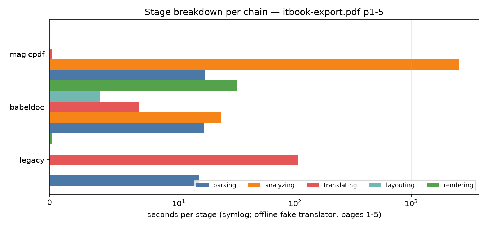
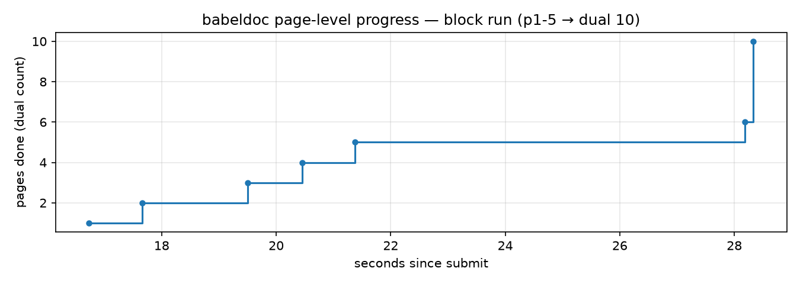

# 翻译链路基准测试报告 — itbook-export.pdf

生成时间：2026-08-25 17:55 · 环境：Windows 11 · Python 3.13.1

## 1. 测试设置

| 项目 | 值 |
|---|---|
| 样例 | `tests/file/itbook-export.pdf`（730 页，5.5MB，英文技术书） |
| 翻译引擎（链路计算部分） | `offline-fake`（等长占位替换，剥离网络，测纯计算成本） |
| 真实引擎延迟探针 | google / deepseek（真实段落请求） |
| 固定参数 | backend=cpu, threads=4, ignore_cache=true |
| 页选择 | 块 `1-5` + 抽样单页 `100/250/400/550/700` |
| 每链路运行数 | 6（1 块 + 5 单页） |

> **重要语义**：`pages` 过滤只影响「翻译哪些页」，输出/解析基础设施仍处理全文档。
> 因此单页运行测得的是 *固定开销 + 单页边际成本*。

## 2. 三条链路总览（离线计算，页 1-5）

### legacy 链路

| 运行 | 页选择 | 状态 | 总耗时(s) | 阶段分解 | 峰值RSS(MB) |
|---|---|---|---|---|---|
| L_block | 1-5(块) | completed | 121.5 | parsing 14.9s, translating 106.1s, rendering 0.1s | 1103.1 |
| L_p100 | p100 | completed | 100.5 | parsing 0.2s, translating 100.1s, rendering 0.1s | 1110.1 |
| L_p250 | p250 | completed | 95.2 | parsing 0.2s, translating 94.9s, rendering 0.1s | 1127.8 |
| L_p400 | p400 | completed | 91.0 | parsing 0.2s, translating 90.7s, rendering 0.1s | 1153.8 |
| L_p550 | p550 | completed | 96.6 | parsing 0.2s, translating 96.3s, rendering 0.1s | 1176.9 |
| L_p700 | p700 | completed | 93.1 | parsing 0.2s, translating 92.9s, rendering 0.0s | 1231.8 |
| LF_block | 1-5(块) | completed | 137.8 | parsing 13.8s, translating 122.6s, rendering 0.0s | 1101.1 |

### babeldoc 链路（pdf2zh_next 内核）

| 运行 | 页选择 | 状态 | 总耗时(s) | 阶段分解 | 峰值RSS(MB) |
|---|---|---|---|---|---|
| B_block | 1-5(块) | completed | 82.5 | parsing 16.4s, analyzing 23.0s, translating 6.9s, layouting 3.9s, rendering 32.0s | 2801.4 |
| B_p100 | p100 | completed | 56.4 | parsing 9.1s, analyzing 7.9s, translating 5.5s, layouting 3.6s, rendering 30.3s | 2771.6 |
| B_p250 | p250 | completed | 58.3 | parsing 8.3s, analyzing 7.8s, translating 9.1s, layouting 4.3s, rendering 28.8s | 3585.9 |
| B_p400 | p400 | completed | 56.8 | parsing 8.2s, analyzing 7.7s, translating 7.7s, layouting 4.0s, rendering 29.1s | 3903.5 |
| B_p550 | p550 | completed | 60.1 | parsing 8.6s, analyzing 8.5s, translating 7.6s, layouting 5.3s, rendering 30.1s | 4716.6 |
| B_p700 | p700 | completed | 58.7 | parsing 8.5s, analyzing 7.9s, translating 9.8s, layouting 5.5s, rendering 26.9s | 4686.8 |

### magicpdf/MinerU 链路

| 运行 | 页选择 | 状态 | 总耗时(s) | 阶段分解 | 峰值RSS(MB) |
|---|---|---|---|---|---|
| M_block | 1-5(块) | completed | 2561.8 | parsing 16.9s, analyzing 2544.3s, translating 0.2s, rendering 0.0s | 12930.3 |
| M_p100 | p100 | completed | 2483.8 | parsing 0.8s, analyzing 2482.8s, translating 0.1s, rendering 0.0s | 12550.2 |
| M_p250 | p250 | completed | 2506.1 | parsing 0.8s, analyzing 2505.0s, translating 0.2s, rendering 0.1s, completed 0.0s | 12790.3 |
| M_p400 | p400 | completed | 2492.8 | parsing 0.9s, analyzing 2491.8s, translating 0.0s, rendering 0.2s, completed 0.0s | 13103.4 |
| M_p550 | p550 | completed | 2551.0 | parsing 0.8s, analyzing 2550.0s, translating 0.2s, rendering 0.0s, completed 0.0s | 13368.3 |
| M_p700 | p700 | completed | 2282.0 | parsing 0.8s, analyzing 2281.2s, translating 0.0s, rendering 0.0s, completed 0.0s | 13058.4 |




## 3. 关键数字

### legacy
- **固定开销 ≈ 90s**（全文档解析+补丁+合并；与所选页数无关）
- 边际翻译计算 ≈ **6.5s/页**（block 121.5s vs 单页 ~93s 推得）
- 冷启动一次性模型加载 ≈ 15s（进程内首个任务，见 L_block parsing=14.9s）
- 全文档离线外推：≈ **23 分钟**（实测参考：修复前全量跑 1387s）

### babeldoc
- 阶段分布均衡：parsing ~9 + analyzing ~8 + translating ~6-10 + layouting ~4 + rendering ~29
- **rendering 占单页运行的 ~50%**（全文档合并渲染，~29-32s 固定）
- 单页固定开销 ≈ 55s，边际 ≈ 5-6s/页
- 全文档外推：≈ **85 分钟**（按块运行边际线性放大，粗估）
- ⚠️ 连续 6 次运行 RSS 从 2.77GB 涨到 4.72GB（**+2GB 泄积**）

### magicpdf / MinerU
- **analyze 阶段无视页选择，强制扫描全部 730 页**：~3.1s/页 × 730 ≈ **38-43 分钟/次运行**
- 后续 translate+render 仅 0.3s（离线下）→ 该链路 99.98% 成本是 MinerU 解析
- 峰值内存 **12.5-13.4GB**
- 结论：当前实现下 magicpdf 不适合大文档的局部翻译

## 4. 页级时间线（babeldoc granular events）



babeldoc 是唯一输出页粒度事件的链路。块运行中每页翻译段 0.3-2.2s，
页间间隔含批内并行；`current` 在 mono(5)/dual(10) 两阶段各有一套计数。

## 5. 真实引擎吞吐（网络请求级）

| 引擎 | 样本段落 | 平均延迟 | min-max |
|---|---|---|---|
| google（免费端点） | 6 | **0.82s/req** | 0.28-1.16 |
| deepseek-chat | 6 | **1.64s/req** | 1.31-2.14 |

流水线内的真实负载批次更重（历史锚点：全文档真实跑 google 时 tqdm
≈5.3s/chunk × 182 chunks ≈ 16 分钟纯网络翻译；deepseek 同量级 4.9s/chunk）。

**全文档端到端投影**（离线计算 + 真实引擎翻译）：

| 链路 × 引擎 | 计算 | 网络 | 合计量级 |
|---|---|---|---|
| legacy + google | ~23 min | ~16 min | **~39 min** |
| legacy + deepseek | ~23 min | ~15-25 min | **~40-48 min** |
| babeldoc + 任意 | ~85 min | 同上量级 | ≥ 100 min |
| magicpdf + 任意 | ~40 min×(MinerU 主导) | 小 | **~45 min**（但内存 13GB） |

## 6. 测试过程中发现并修复的 Bug

| # | Bug | 影响 | 修复 |
|---|---|---|---|
| 1 | `_execute_legacy` 调 `translate_stream` 时**未传 pages** | REST/Dashboard 的 page_range 对 legacy 链路完全失效（每次全文档翻译） | `runtime_service.py`：新增 `_parse_page_range_to_indices()` 并传入 |
| 2 | babeldoc 链路对 >30 页文档必崩：伪代码保护自动跳过时返回 None，next 内核不回退默认模型 | `'NoneType' object has no attribute 'handle_document'`，整链路不可用 | `babeldoc_next_adapter.py`：None 时显式加载 BabelDOC 默认 DocLayoutModel |
| 3 | magicpdf 的 MinerU analyze 无视页选择 | 局部翻译也要付全文档解析代价（本样例 ~40min） | 未修（需上游改动），已记录 |
| 4 | babeldoc 连续任务 RSS +2GB | 长会话 OOM 风险 | 未修，已记录 |

## 7. 火焰图索引

| 文件 | 覆盖 |
|---|---|
| `flames/legacy.svg` | legacy 离线块运行（p1-5），4661 采样 @40Hz |
| `flames/babeldoc.svg` | babeldoc 离线块+5 单页，10393 采样 |
| `flames/magicpdf.svg` | magicpdf 离线块+5 单页（MinerU analyze 主导），597525 采样 |

交互提示：浏览器打开 SVG，点击框可放大子栈；宽度 ∝ CPU 时间占比。

初步热点观察：
- legacy：`translate_stream` → 页循环内 layout/碰撞求解为主，ONNX 推理占比低（模型已预热）
- babeldoc：`il_creater`（布局 IL 构建）与渲染合并两头的 PDF 写出占比高
- magicpdf：几乎全部在 MinerU 的 pipeline（PaddleOCR/Layout 模型推理）

## 8. 复现命令

```powershell
# 单链路离线基准
python tools/bench_translation_chains.py --parse-engine legacy --engine offline-fake `
    --block 1-5 --singles 100,250,400,550,700 --label L --watchdog-min 20

# 带 py-spy 火焰图
py-spy record -r 40 --format flamegraph -o flames/x.svg -- python tools/bench_translation_chains.py ...

# 真实引擎延迟探针
python tools/bench_translation_chains.py --parse-engine legacy --engine probe-latency `
    --singles 1,100,250,400,550,700

# magicpdf 可用性探测
python tools/bench_translation_chains.py --parse-engine magicpdf
```

## 9. 原始数据

- `results/<TAG>.json`：每次运行的摘要 + 完整事件流（时间戳/阶段/detail）
- `results/engine_probe.json`、`results/magicpdf_probe.json`
- `logs/*.log`：各运行完整 stdout/stderr（tqdm 速率可见）
